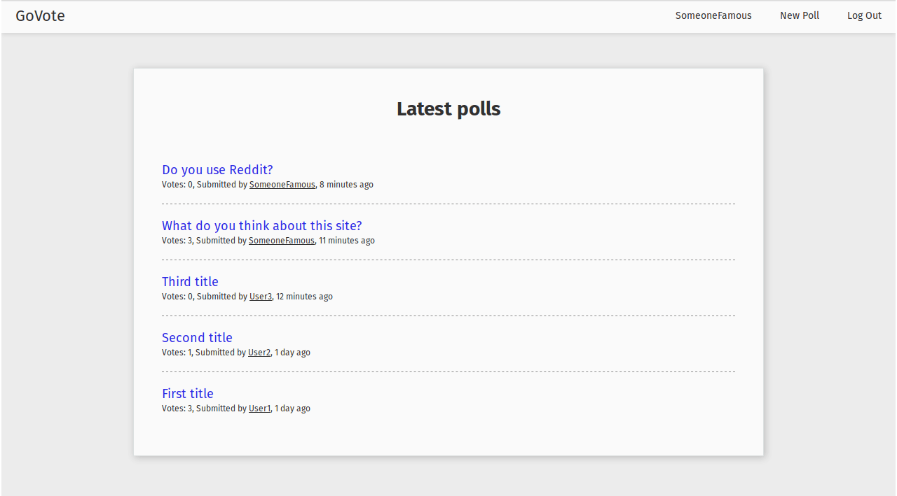
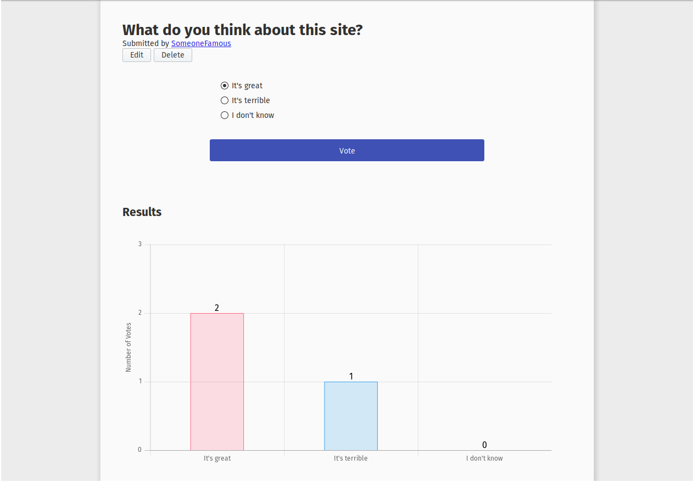
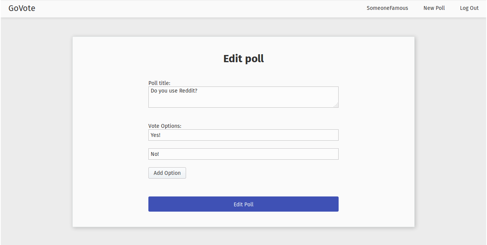
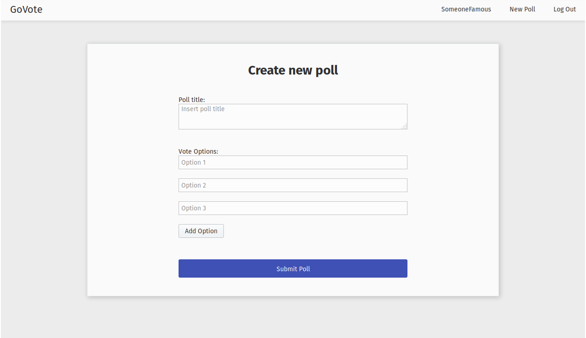
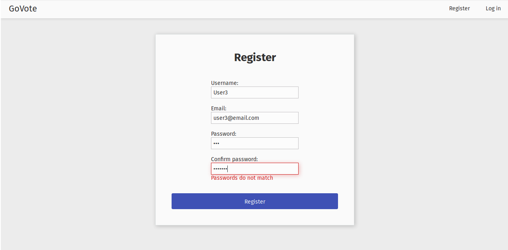
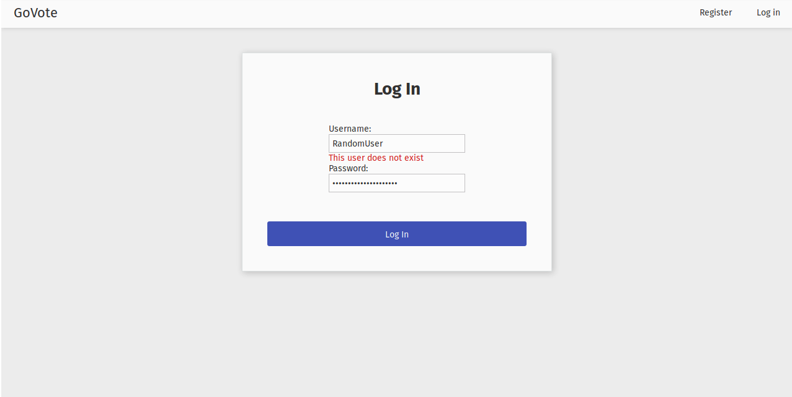
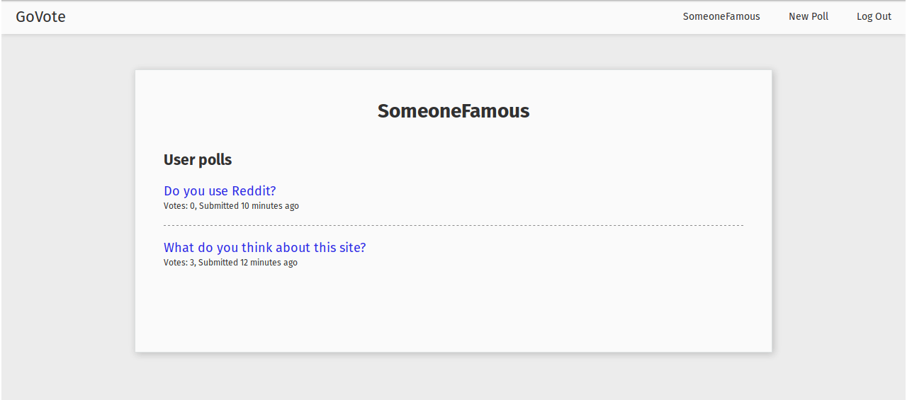

# GoVote
Voting application based on the rules of Voting Application from FreeCodeCamp backend section

# Screenshots

## Front page of the application

## Displaying poll

## Editing existing poll as the poll author

## Creating new poll

## Register

## Login

## Displaying User polls

# Implemented User stories:

* User Story: As an authenticated user, I can keep my polls and come back later to access them.

* User Story: As an authenticated user, I can share my polls with my friends.

* User Story: As an authenticated user, I can see the aggregate results of my polls.

* User Story: As an authenticated user, I can delete polls that I decide I don't want anymore.

* User Story: As an authenticated user, I can create a poll with any number of possible items.

* User Story: As an unauthenticated or authenticated user, I can see and vote on everyone's polls.

* User Story: As an unauthenticated or authenticated user, I can see the results of polls in chart form. (This could be implemented using Chart.js or Google Charts.)

* User Story: As an authenticated user, if I don't like the options on a poll, I can create a new option.

# Database design

## Poll

    (id serial primary key,
    createdy_by integer references User(id) on delete cascade,
    time TIMESTAMPTZ DEFAULT CURRENT_TIMESTAMP,
    title text);

## PollOption

    (id serial primary key,
    poll_id integer references Poll(id) on delete cascade,
    option text);

## Users

    (id serial primary key,
    username varchar(50) unique,
    email text unique,
    password_hash varchar(60) NOT NULL);

## Vote

    (id serial,
    poll_id integer references poll(id) on delete cascade,
    option_id integer references pollOption(id) on delete cascade,
    voted_by integer references user(id) on delete cascade);